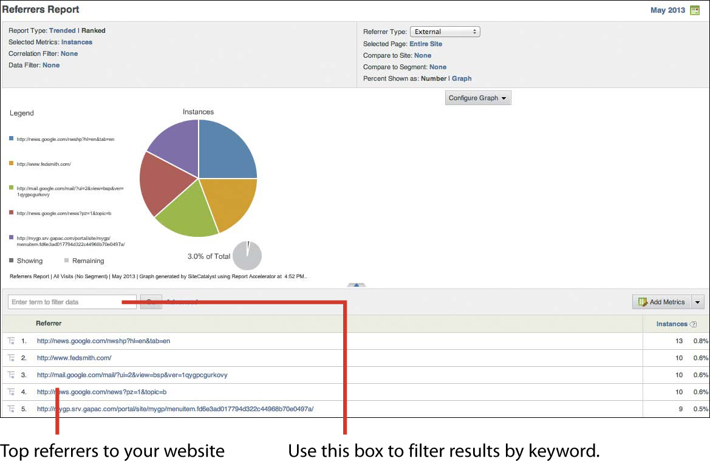

# Awareness Analytics

### Brand awareness is the ultimate prize for online marketing teams, who attempt to reach broader sets of customers around the globe more frequently. Awareness is the measurement used to understand if customers are conscious of your brand, know about your company, and are familiar with its products and/or services.

## There are many ways to track brand awareness, but here is a list of the top three methods:

* Third-party providers—These companies provide market research to determine how your company measures up against its peers.
* Offline research studies—Organizations use these studies to poll broad groups of people about their familiarity with your company.
* Online analytics and tools—Using your website’s analytics to measure brand awareness is increasingly becoming the de facto method amongst marketers. You can pull information from Twitter, Facebook, and LinkedIn into Adobe Analytics to gain further insights about your brand.

## The following tasks will offer insight into the effectiveness of channel campaigns, keywords, and affiliates and offer direction to where you can find optimization.  

----

## Task: Key Metrics Report
\
 
 
 
 
 

---

## Task: Referring Domain and Referrers Reports
\
 
 
 
 
 

----

## Task: Analyze marketing efforts effectiveness
    * Report: Online vs. offline campaigns
    * Report: Channel performance
    * Report: Referring domains
    * Report: Referrers and referrer types
\
 
 
 

----

## Task: Analyze email marketing campaigns
    * Report: Email channel performance
\
 
 

----

## Task: Analyze mobile (SMS/MMS) marketing
    * Report: SMS channel performance
\
 

----

## Task: Analyze search engine marketing (organic search optimization)
    * Report: Organic search keyword performance
    * Report: Organic search engine effectiveness
\
 
 

----

## Task: Analyze paid search engine marketing
    * Report: Paid search performance
    * Report: Paid search engine effectiveness
    * Report: Paid keywords performance
\
 
 

----

## Task: Analyze social media campaigns
    * Report: Social channel performance
\
 
 

----

## Task: Analyze online display advertising
    * Report: Display channel performance
\
 

----

## Task: Analyze affiliate marketing
    * Report: Affiliate channel performance
\
 

----

## Task: Analyze internal online campaigns
    * Report: Internal banner and links performance
\
 

----

## Task: Understand multichannel and cross-channel visits and attribution
    * Report: Marketing channel overview
    * Campaigns report and marketing channels
\
 
 

---

## Conclusion
Awareness reports help you validate some key information about your visitors:
* How effective are your marketing campaigns at driving visits and
conversion? This helps you understand the success of each channel you’re
invested in and the portfolio of your campaign spend.
* Which channel attributes drive the most revenue? This helps you to
understand whether you’re bidding on the right set of keywords, affiliates, and so
on.
* Who are the top referrers to your sites? This will give you insight into the demographics of your visitor traffic from specific referrers.