# Acquisition Analytics

### Acquisition analytics help you know your user base and measure visitor activity. More than likely, one of your KPIs is to increase traffic. To do that, you first have to create a comprehensive view of your audience.

## These are the helpful tasks and reports:  

---

##  Task: Understand visits
    * Report: Analyze total visits
\
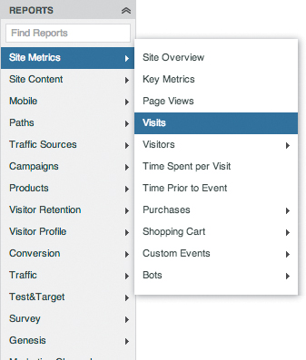 
\
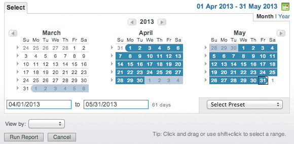 
\
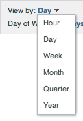 
\
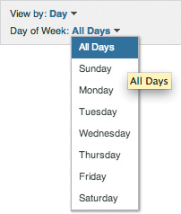 
\
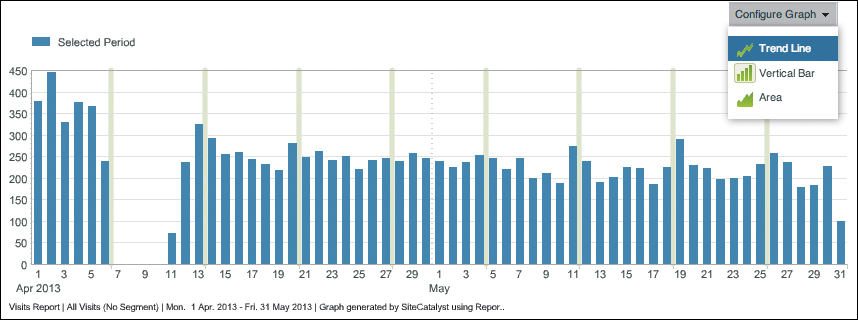 
\
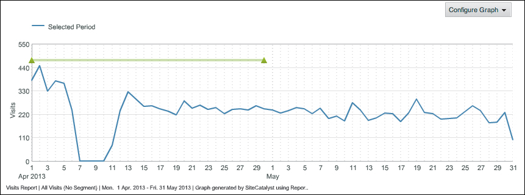 
\
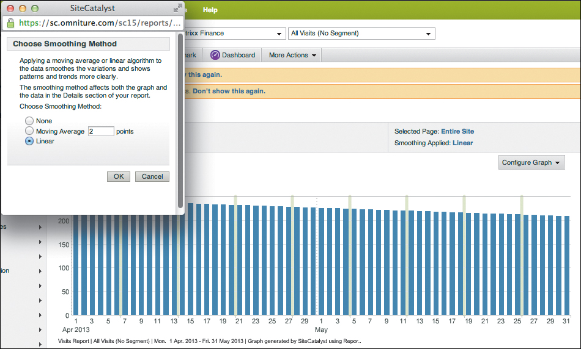 
\
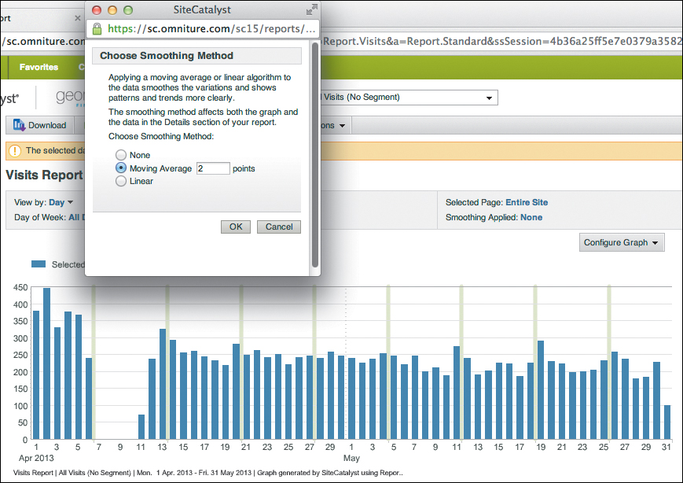 

---

## Task: Understand unique visitors trends
    * Report: Analyze unique visitors
    * Report: Analyze hourly unique visitors
    * Report: Analyze daily unique visitors
    * Report: Analyze weekly unique visitors
    * Report: Analyze monthly unique visitors
    * Report: Analyze quarterly unique visitors
    * Report: Analyze yearly unique visitors
\
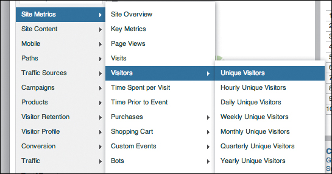 
\
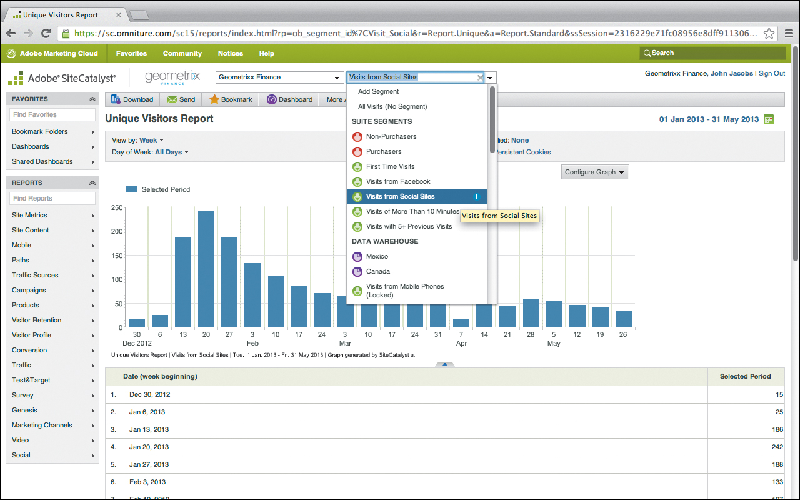 
\
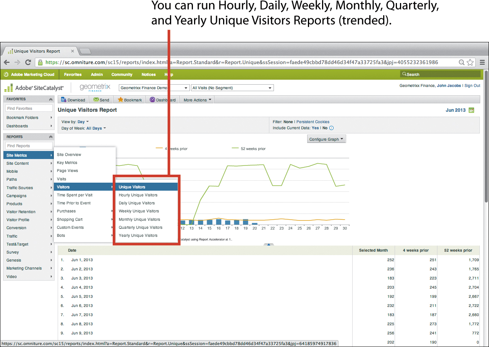 
\
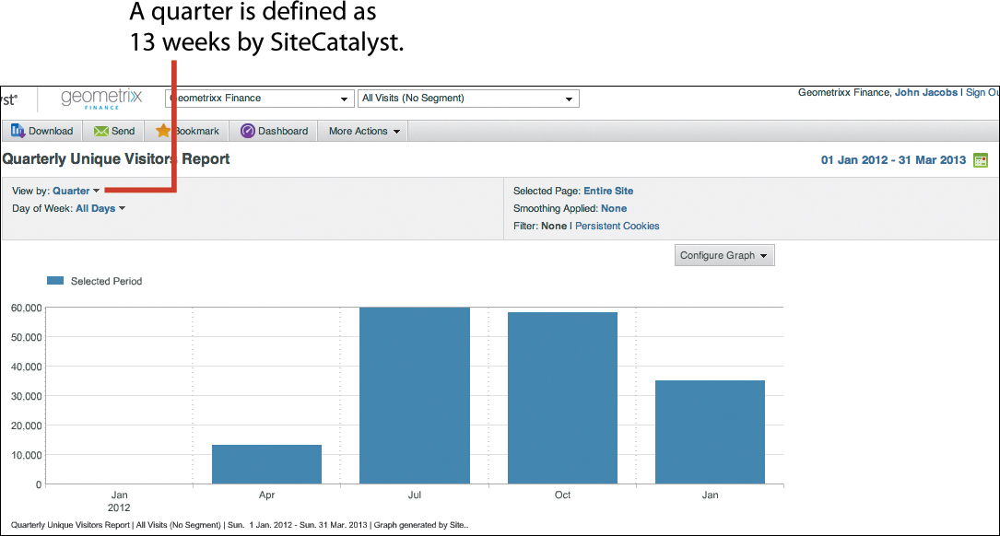 
\
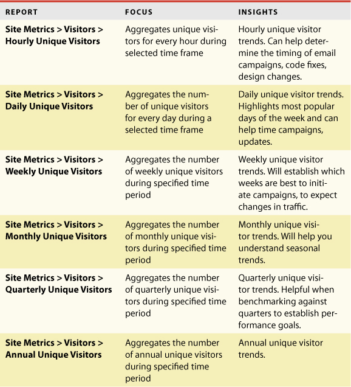 

---

##  Task: Understand where to focus your marketing efforts
    * Report: Analyze country, region, city, state, or DMA of visit origin
    * Report: Analyze preferred time zones
\
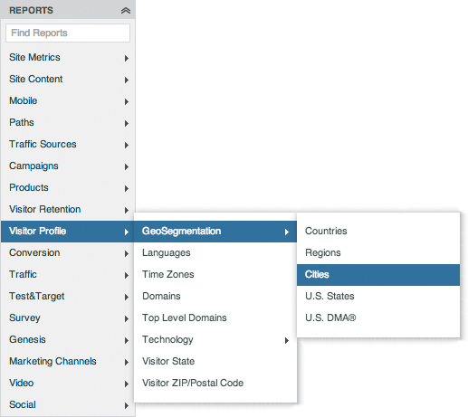 
\
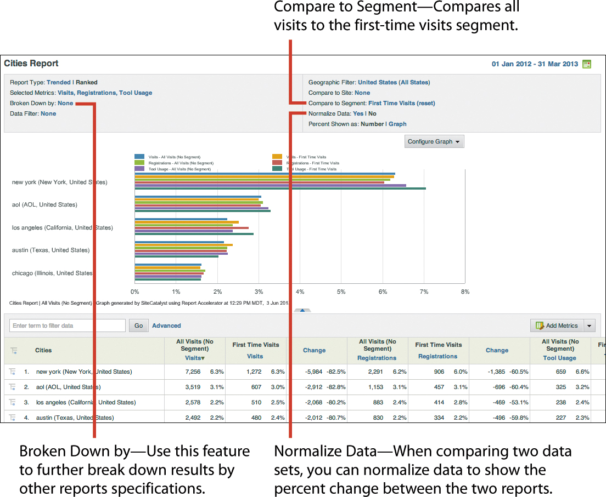 
\
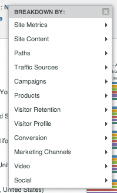 
\
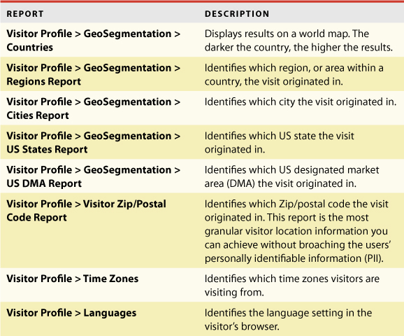 

---

##  Task: Understand visitor demographics
    * Report: Analyze visitor demographics
\
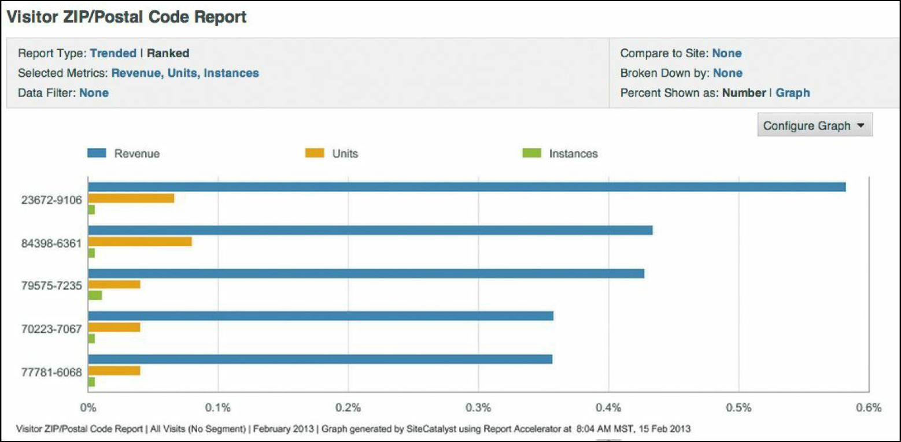 

---

## Task: Understand domains of origin
    * Report: Analyze domains
    * Report: Analyze top-level domains
\
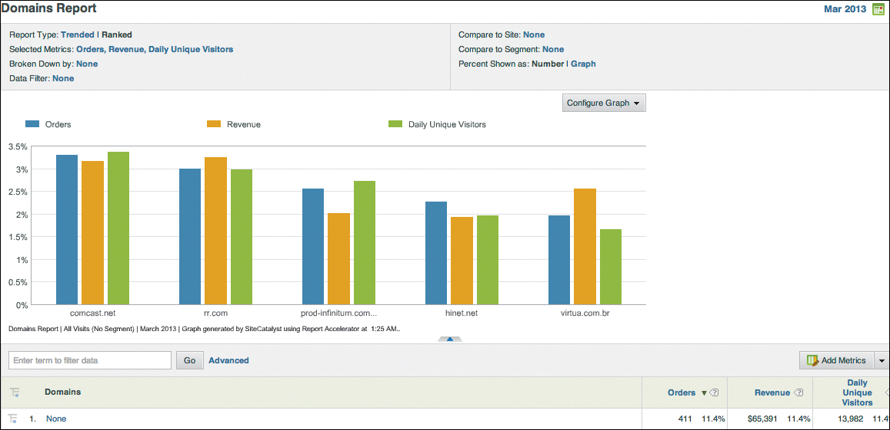 
\
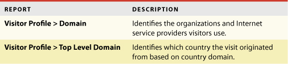 

---

## Conclusion
Acquisition reports help you validate some key information about your visitors:
* What are the total number of visits and unique visitors to your site? This helps you understand your brand’s value and determine general interest in your products.
* Which new and repeat unique visitors are coming to your site? This helps
you understand the sustained interest in your brand and your products.
* What are the geographical locations of the visitors to your site? This helps you understand whether you need to run geotargeted marketing campaigns specific to the geographical locations where you want to increase traffic or expand operations.
* What are the demographics of the key visitors coming to your site? This
question may be pertinent if you’re collecting specific visitor information.