# Engagement Analytics

### Engagement analytics measure the connectedness of users with your website. The purpose is to increase the level of trust and communication with visitors, and ultimately increase revenue. To achieve higher levels of engagement, you must evaluate the user experience. Are visitors able to find what they’re looking for? Does the content compel them to dive deeper? Is your navigation helpful or frustrating?  

## The series of reports outlined in this section can help you evaluate these areas of engagement.

---

## Task: Manage visitor experience
    * Report: Understand page not found errors
    * Report: Understand single page visits
\
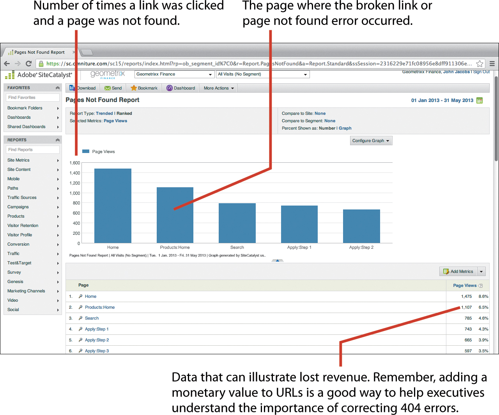 
\
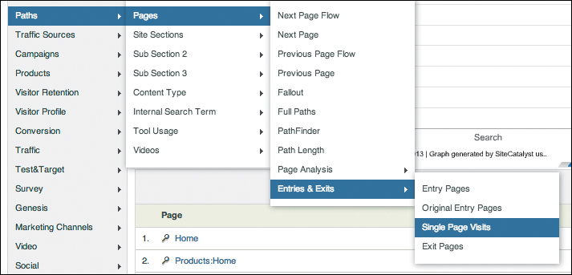 
\
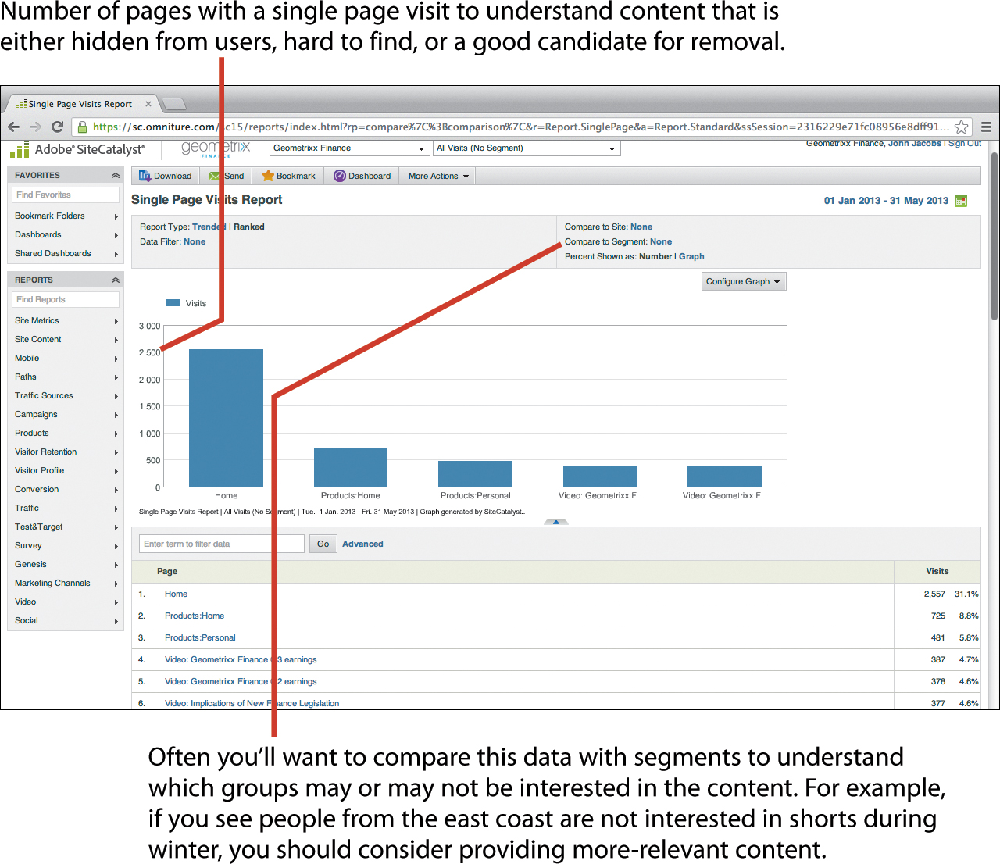 

---

## Task: Understand engaging content
    * Report: Analyze total page views
    * Report: Analyze time spent per visit
    * Report: Analyze pages
    * Report: Analyze visit trends
    * Report: Analyze visit trends by hierarchy
\
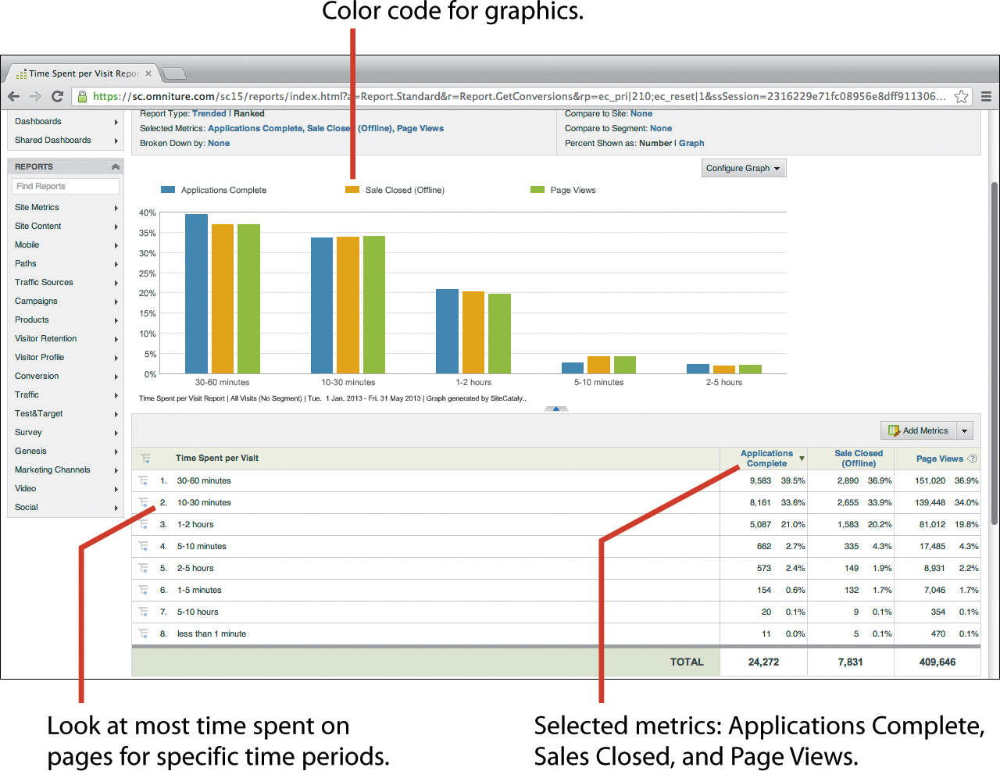 
\
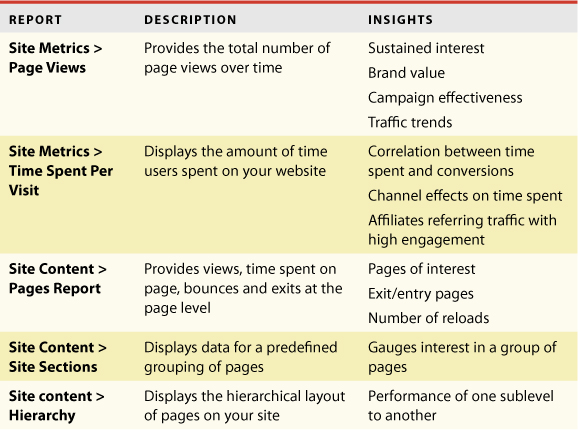 
\
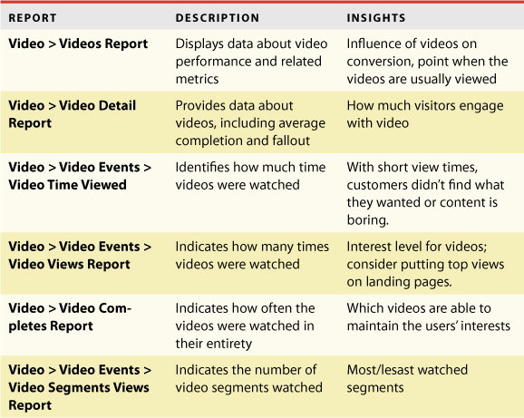 

---

## Task: Understand use of rich media content
    * Report: Analyze video overview
    * Report: Analyze videos
    * Report: Analyze video detail
    * Report: Analyze video events
    * Report: Analyze video variables
\
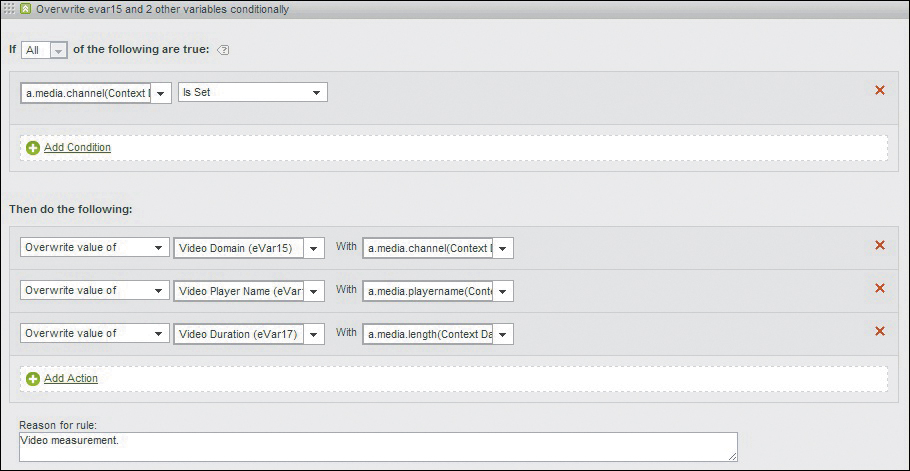 
\
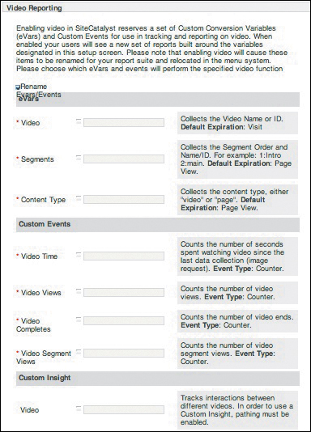 
\
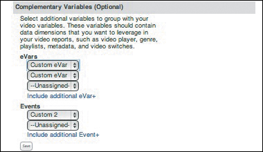 

---

## Task: Understand path analysis
    * Report: Analyze next page flow and previous page flow
    * Report: Analyze next page and previous page
    * Report: Analyze fallout
    * Report: Analyze full paths
    * Report: Analyze path finder
    * Report: Analyze path length
    * Report: Analyze page summary
    * Report: Analyze reloads
    * Report: Analyze time spent on page
    * Report: Analyze clicks to page
\
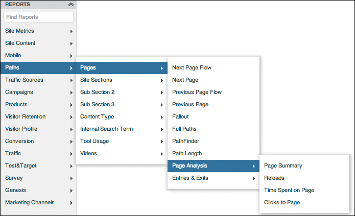 
\
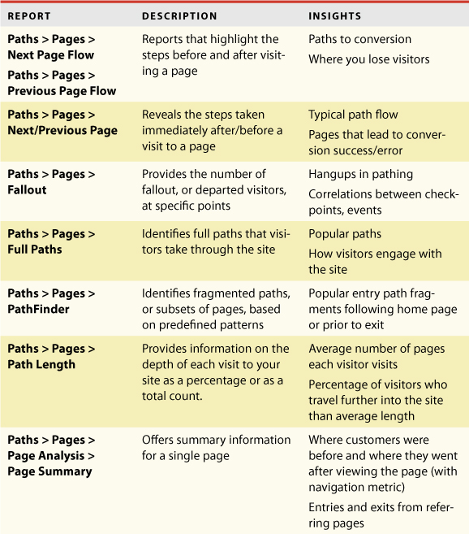 
\
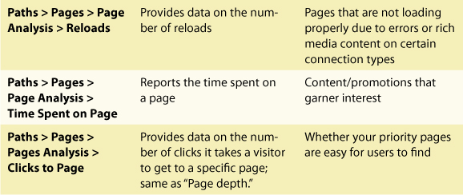 

---

## Task: Understand landing pages preferences
    * Report: Analyze entry pages
    * Report: Analyze original entry pages
    * Report: Analyze exit pages
\
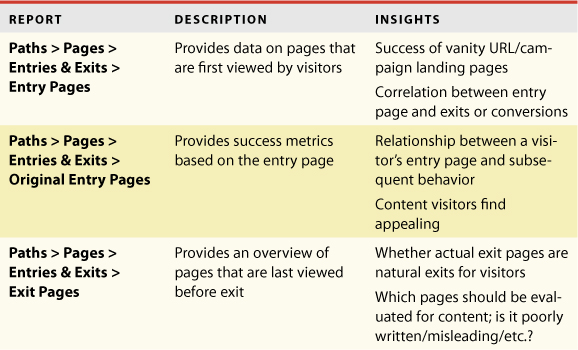 

---

## Task: Understand navigation
    * Report: Analyze custom links
    * Report: Analyze downloads
    * Report: Analyze exit links
\
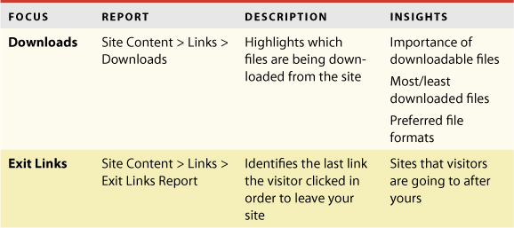 

---

## Conclusion
The visitor’s experience will have a high impact on his motivation to convert on your site.
* Is the visitor having a good experience on your website? This can be
determined by the visitor’s behavior on the site. A visitor normally has a good
experience if he’s able to complete the personal goal he had in mind when he
came to your site. If the visitor gets an error on the page, the site loads too
slowly, or the content does not engage him, you’ll see a high bounce rate and
lower conversion.
* Does the visitor find the content engaging? How much time is he spending
on it? Understanding how the visitor is engaging with the site and how much
time he’s spending on the content will give you an idea of which content is most
influencing his decisions.
* How is the visitor navigating through your site? What paths or links does he
prefer? Following the visitor’s path can give you insights into the purpose of his
visit. Also, it gives you an idea of the sales cycle stage he is in.
* Is he viewing any videos or rich media content? This sheds light on the
visitor’s demographics and his propensity to engage with video and rich media
content.
* Which landing pages are preferred by the visitor? What’s the bounce rate
and exit rate on those pages? This will give you insights into which landing
pages need to be optimized to meet the customer expectations.