# Conversion Analytics

### Conversion data offers a view into the monetary impact of marketing and technology decisions. The results are of interest to all levels of the organization, particularly decision-makers. They offer the nuts and bolts of site performance and help you target visitors and turn casual browsers into buyers/customers.

---

## The Conversion Funnel reports illustrate the process of conversion with beginning, ending, and milestone events represented.
### Conversion reports are customizable, so you can add custom conversion events. The conversion reports track your ability to achieve macro goals. Macro goals are actions on your website (such as purchasing a product, servicing a request, or signing up for a mailer) that allow you to achieve business objectives.
\
\
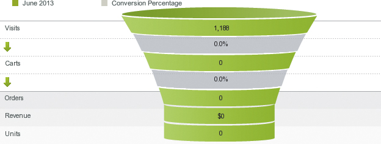 
\
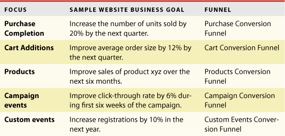 
\
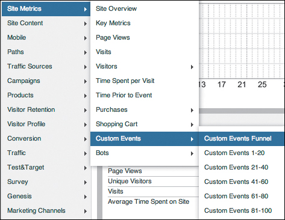 

---

## Task: Manage macroconversions (purchase focus)
    * Report: Understand purchase conversion funnel
    * Report: Understand revenue
    * Report: Understand orders
    * Report: Units
\
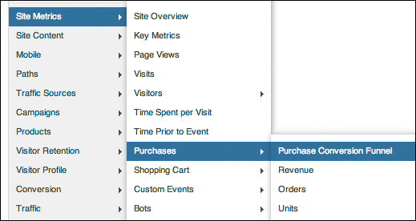 
\
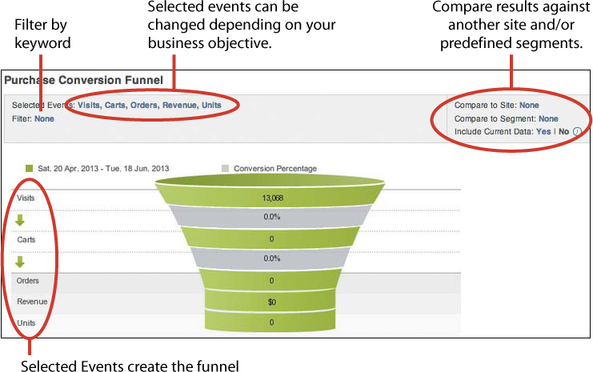 
\
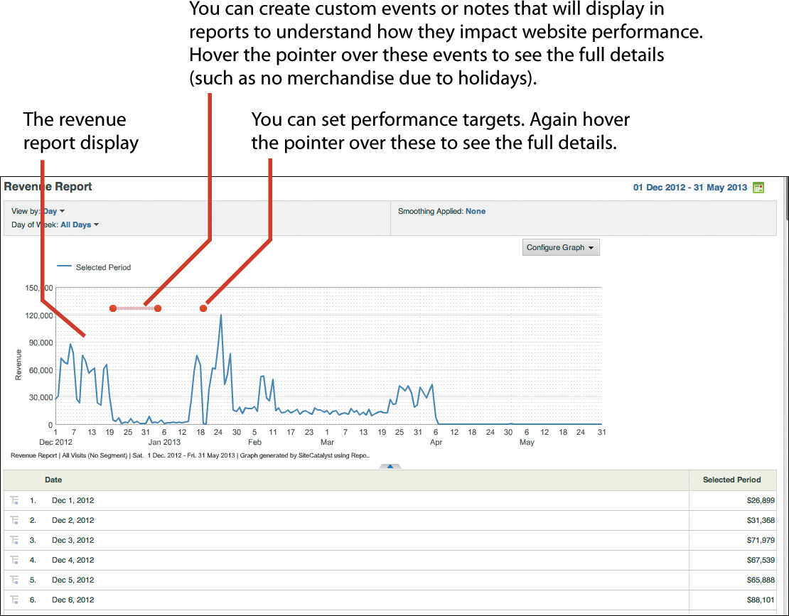 
\
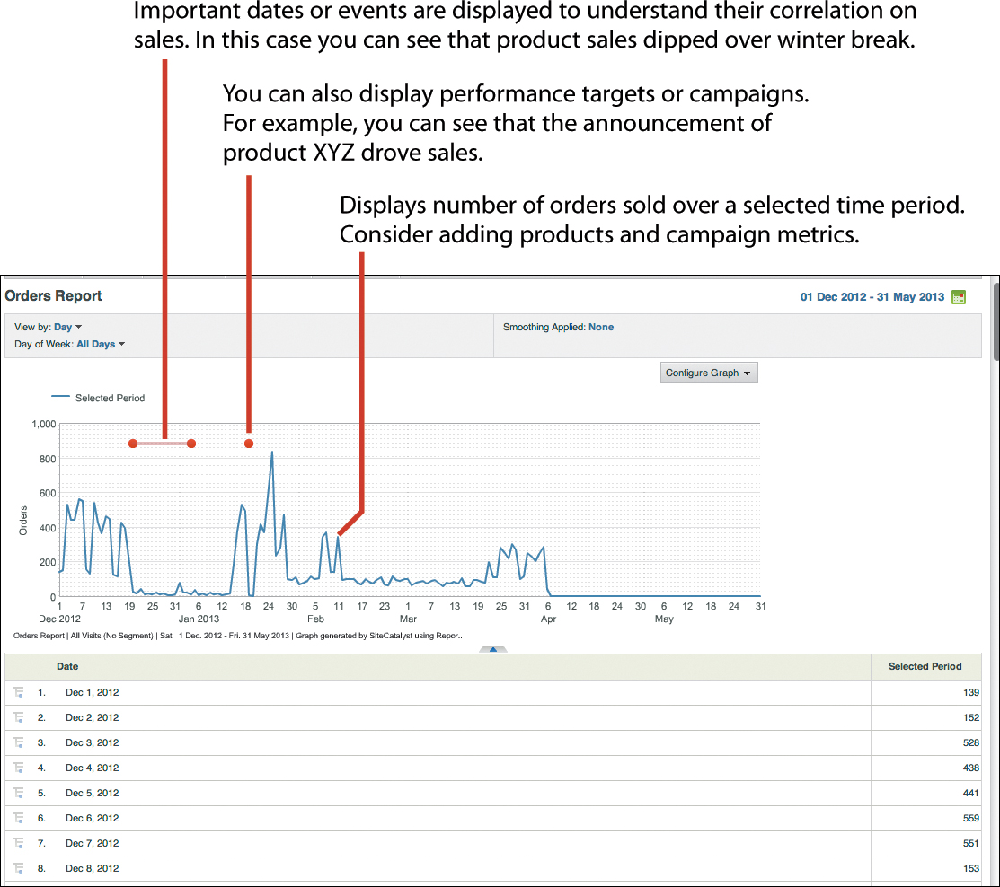 
\
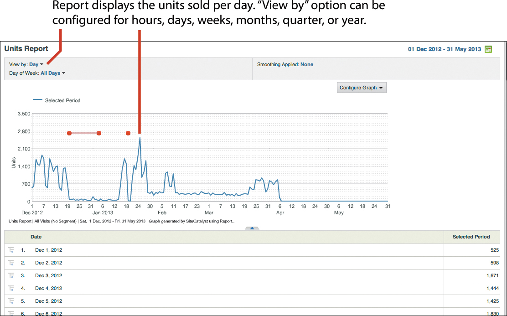 

---

## Task: Manage macroconversions (cart focus)
    * Report: Understand cart conversion funnel
    * Report: Understand number of carts
    * Report: Understand number of cart views
    * Report: Understand number of cart additions
    * Report: Understand number of cart removals
    * Report: Understand number of checkouts
\
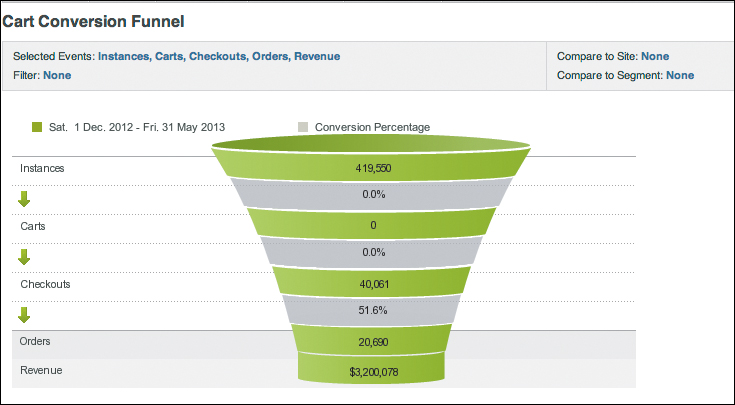 
\
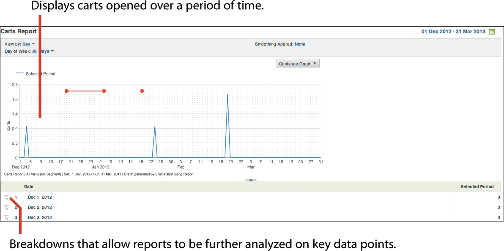 
\
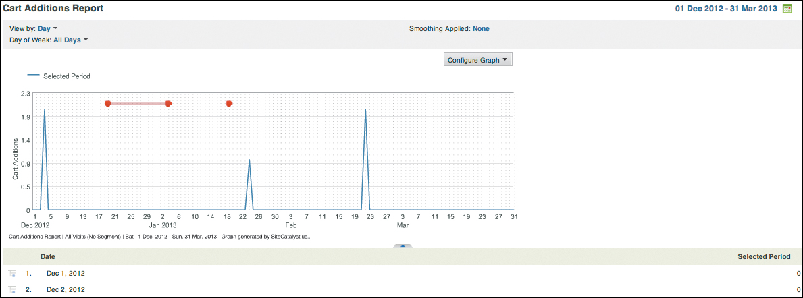 
\
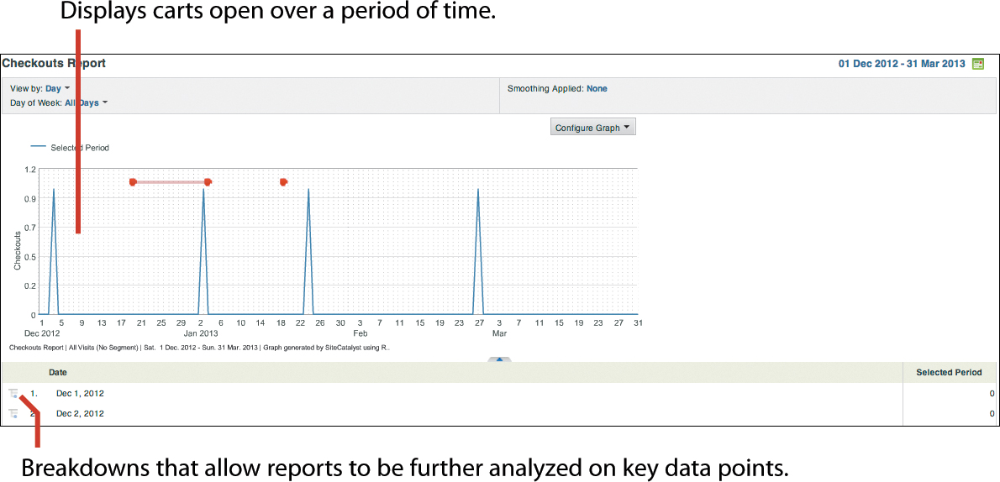 

---

## Task: Manage macroconversions (product focus)
    * Report: Understand product conversion funnel
    * Report: Understand products
    * Report: Understand product cross-sell
    * Report: Understand product categories
\
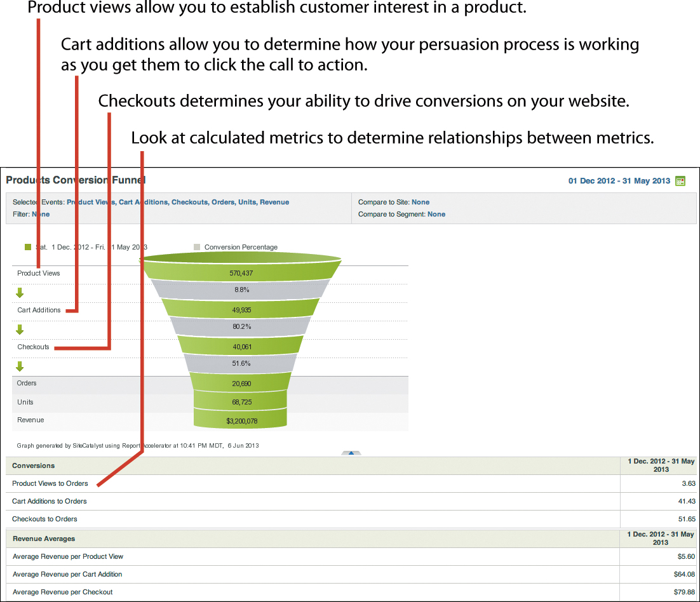 
\
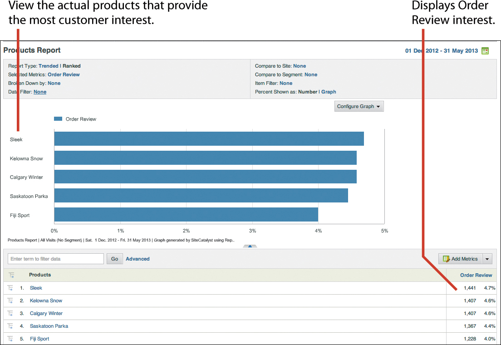 
\
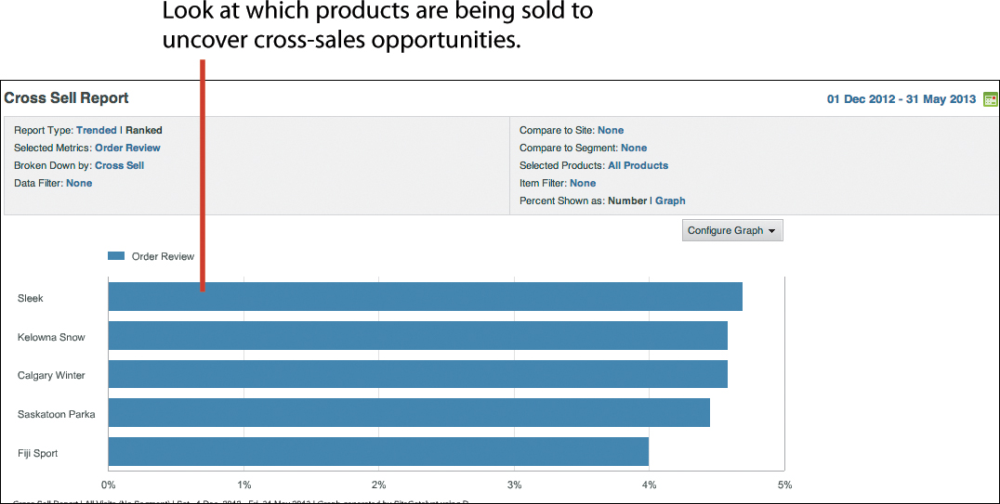 

---

## Task: Manage macroconversions and microconversions (custom events)
    * Report: Review conversion funnel fulfillment and abandonment
    * Report: Review form fulfillment and abandonment
\
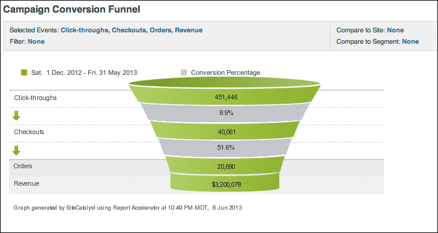 

---

## Conclusion

All of these reports will help you determine next steps in focusing your analytics effort:
* What are the total units, orders, and revenue generated on your site? This
helps you understand the total revenue and inventory-related questions.
* How is the cart being used on your site? The cart is a temporary place where
the visitor considers buying your products. These reports will help you determine
which pattern or sequence of steps pushes toward an order as opposed to the
visitor abandoning his cart.
* What products are being sold in high volume or cross-sold? The productrelated
reports highlight the products and categories that are popular among your
visitors. The audience that you’re actively targeting and the visitor demographics
on your site may be different. These reports will help you bridge that gap.
* Are the microconversions successful? This question may be pertinent if you’re
tracking any microconversions, such as newsletter sign-ups or registrations.
Since SiteCatalyst has no default variables or reports for these, they must be
configured.