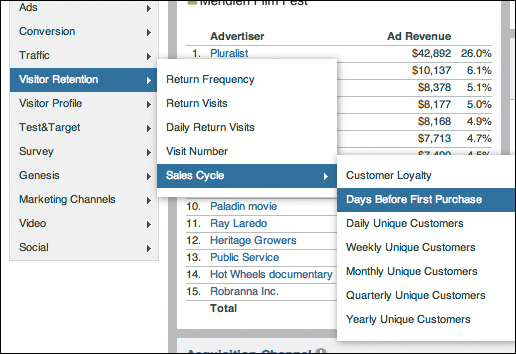
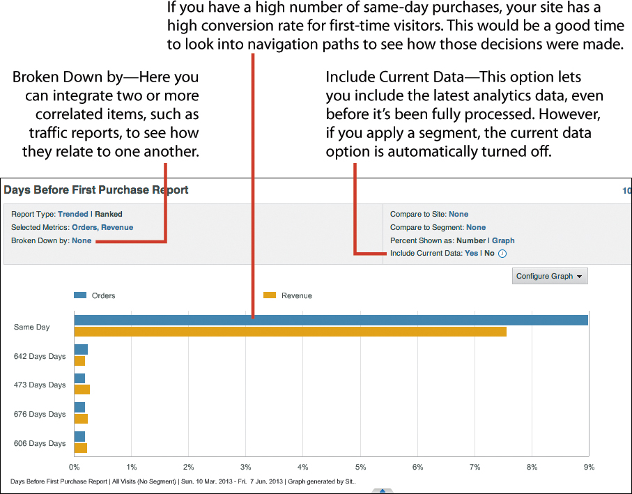
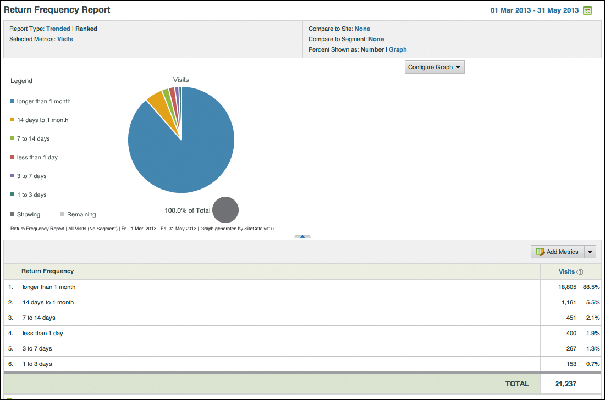
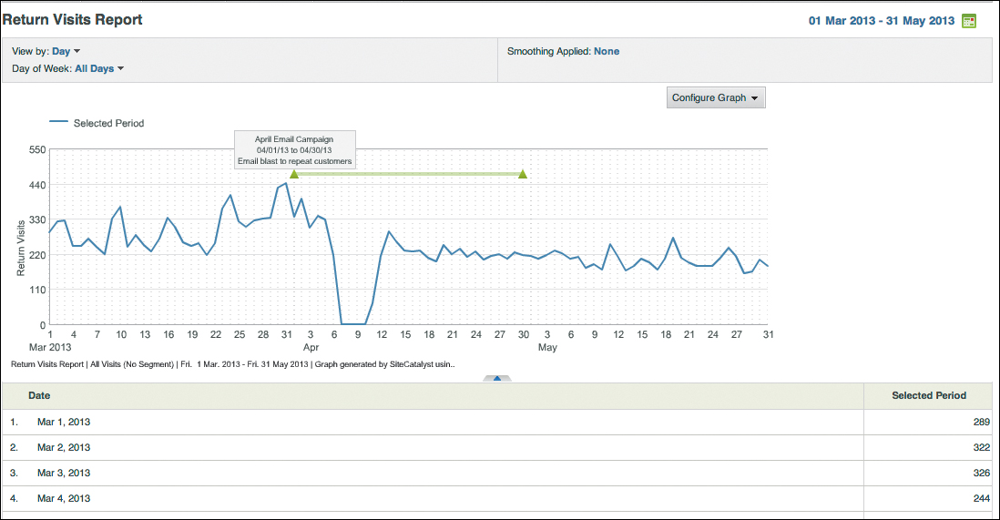
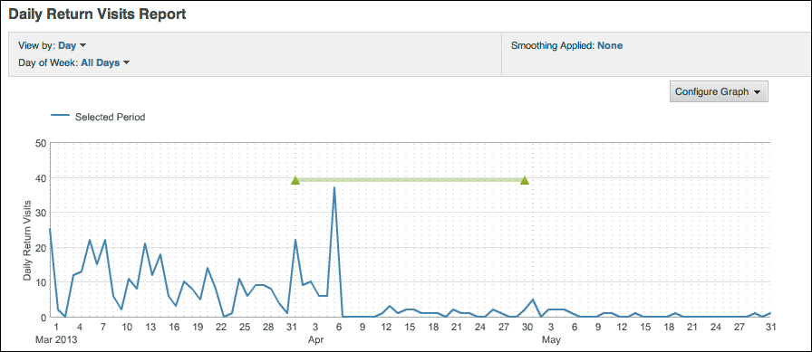
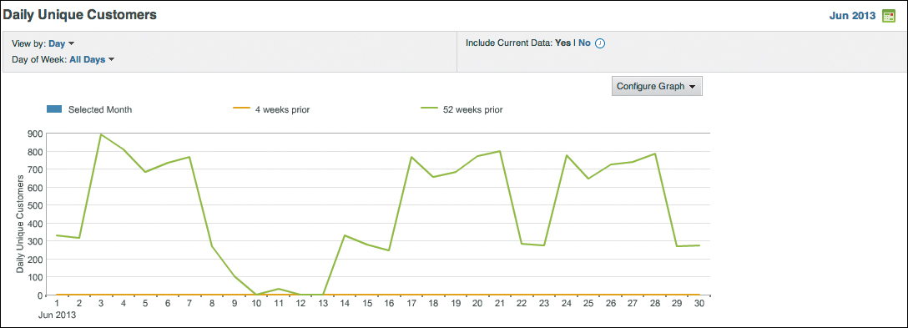
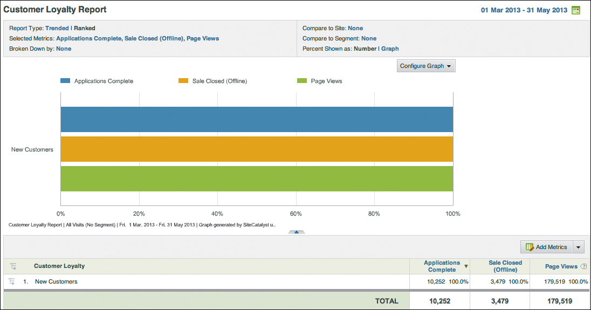
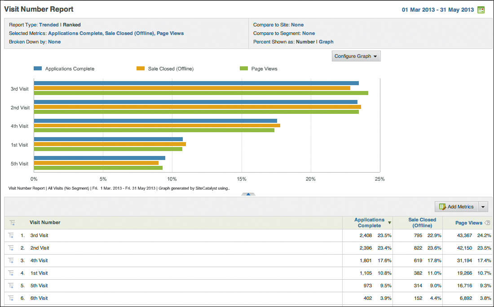

# Retention Analytics

### Retention data is extremely valuable in establishing the buying trends of your existing customers. Maintaining a relationship with a repeat customer is generally easier than continually acquiring new customers.

## Retention analytics can be grouped into three fundamental questions:
  * How recently did a customer purchase a product from you?
  * How often a does a customer make a purchase?
  * How frequently does a customer make a purchase?
\

---

## Task: Understand recency
    * Report: Understand days before first purchase
\
 
\
 

---

## Task: Understand frequency
    * Report: Understand return frequency
    * Report: Understand return visits
    * Report: Understand daily return visits
    * Report: Understand unique customers
\
 
\
 
\
 
\
 

---

## Task: Understand monetary
    * Report: Understand customer loyalty
    * Report: Understand visit number
\
 
\
 

---

## Conclusion
All of these reports will help you determine next steps in focusing your analytics effort:
* What are the total units, orders, and revenue generated on your site? This helps you understand the total revenue and inventory-related questions.
* How is the cart being used on your site? The cart is a temporary place where the visitor considers buying your products. These reports will help you determine which pattern or sequence of steps pushes toward an order as opposed to the visitor abandoning his cart.
* What products are being sold in high volume or cross-sold? The productrelated reports highlight the products and categories that are popular among your
visitors. The audience that you’re actively targeting and the visitor demographics on your site may be different. These reports will help you bridge that gap.
* Are the microconversions successful? This question may be pertinent if you’re tracking any microconversions, such as newsletter sign-ups or registrations. Since SiteCatalyst has no default variables or reports for these, they must be configured.